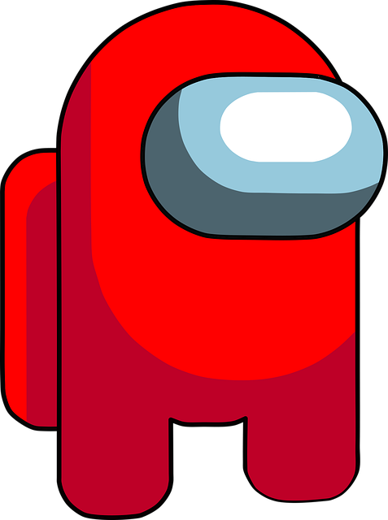

# Sussy Clicker

[Link to GitHub Repository](https://github.com/emanuxd11/SussyClicker)

## Sussyficationers

### Sussy Button
<button id="sussy_button">Click Me</button>

Sussy Meter: 0

Total sus/s: 0

### Helper List
<ul id="helper_list"></ul>

